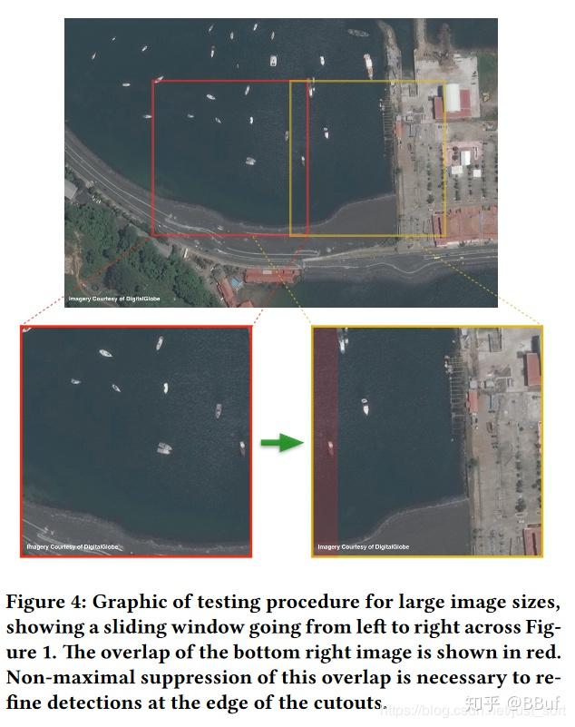

* # YOLT论文笔记

  ​	YOLT论文全称**「You Only Look Twice: Rapid Multi-Scale Object Detection In Satellite Imagery」**，专门为卫星图像检测设计

* 难点和解决方案：

  ```python
      一，卫星图目标的「尺寸，方向多样」。卫星图是从空中拍摄的，因此角度不固定，像船、汽车的方向都可能和常规目标检测算法中的差别较大，因此检测难度大。针对这一点的解决方案是对数据做「尺度变换，旋转等数据增强操作」。二，「小目标的检测难度大」。针对这一点解决方案有下面三点。
  
  1、修改网络结构，使得YOLOV2的stride变成[公式]，而不是原始的[公式]，这样有利于检测出大小在[公式]。
  
  2、沿用YOLOV2中的passthrough layer，融合不同尺度的特征（[公式]和[公式]大小的特征），这种特征融合做法在目前大部分通用目标检测算法中被用来提升对小目标的检测效果。
  
  3、不同尺度的检测模型融合，即Ensemble，原因是例如飞机和机场的尺度差异很大，因此采用不同尺度的输入训练检测模型，然后再融合检测结果得到最终输出。
  
      三，「卫星图像尺寸太大」。解决方案有将原始图像切块，然后分别输入模型进行检测以及将不同尺度的检测模型进行融合。
  ```

  

* 一些观察

  ​	下面的Figure2展示了使用两种不同类型的图像作为输入时模型（原始的YOLOv2）的预测结果对比，左边是直接把卫星图像原图`resize`到![[公式]](https://www.zhihu.com/equation?tex=416%5Ctimes+416)大小，可有看到结果是一辆车都检测不出来。右边则是从原图中裁剪出![[公式]](https://www.zhihu.com/equation?tex=416%5Ctimes+416)大小的区域然后作为模型的输入，可以看到部分车被检测出来了，但是效果一般。从这个实验可以发现，如果直接将原图`resize`到网络输入大小是不靠谱的，所以YOLT采用了裁剪方式进行训练和测试图片。


* 下面的Figure4则展示了在测试模型时如何对输入图像进行处理。



* 上半部分表示的是原始的卫星图片，因为图片分辨率太大，所以采用了划窗方式裁剪指定尺寸如![[公式]](https://www.zhihu.com/equation?tex=416%5Ctimes+416)的图像作为模型的输入，论文将裁剪后的区域称为chip，并且相邻的chip会有15%的重叠，这样做的目的是为了保证每个区域都能被完整检测到，虽然这带来了一些重复检测，但可以通过NMS算法滤掉。通过这种操作，一张卫星图像会被裁剪出数百/千张指定尺寸的图像，这些图像被检测之后将检测结果合并经过NMS处理后就可以获得最终的检测结果了。
* 下面的Figure5展示了训练数据的整体情况，一共有![[公式]](https://www.zhihu.com/equation?tex=5)个类别，包括飞机，船，建筑物，汽车，机场等。对训练数据的处理和测试数据是类似的，也是从原图裁剪多个chip喂给网络。

* **「这篇论文的一个核心操作就是：」**

  针对**「机场目标」**和**「其它目标」**分别训练了一个检测模型，这两个检测模型的输入图像尺度也不一样，测试图像时同理，最后将不同检测模型、不同chip的检测结果合并在一起就得到最终一张卫星图像的输出。也即是说这篇文章的核心操作就是这个**「不同尺度的模型融合」**以及**「针对机场单独训练一个模型」**，这样确实是从数据出发能够很好的解决实际场景（卫星图像）中机场目标数据太少带来的问题。


* 实验结果：
  * 下面的Figure7展示了一张对于汽车目标的检测结果，可以看到效果还是不错的，并且在![[公式]](https://www.zhihu.com/equation?tex=1s)内能获得结果，同时F1值达到0.95。


* 接下来作者还对不同输入分辨率做了实验，下面的Figure10代表对原始分辨率（左上角的0.15m表示GSD是0.15m）进行不同程度的放大之后获得的低分辨率图像，这些图像都被用来训练模型，


* 然后Figure13将不同分辨率输入下检测模型的F1值进行了图表量化，其中横坐标代表目标的像素尺寸。可以看到，随着分辨率的降低，图像中目标的像素尺寸也越来越小，检测效果（F1值）也越来越低。

我们还可以发现<u>**即便目标只有![[公式]](https://www.zhihu.com/equation?tex=5)个像素点，依然有很好的检测效果，但需要注意的是这里的![[公式]](https://www.zhihu.com/equation?tex=5)个像素点指的是在原图上**</u>，你crop之后目标的相对于网络输入的大小肯定是大于![[公式]](https://www.zhihu.com/equation?tex=5)个像素点的，至少让YOLT网络能够检测出来。

